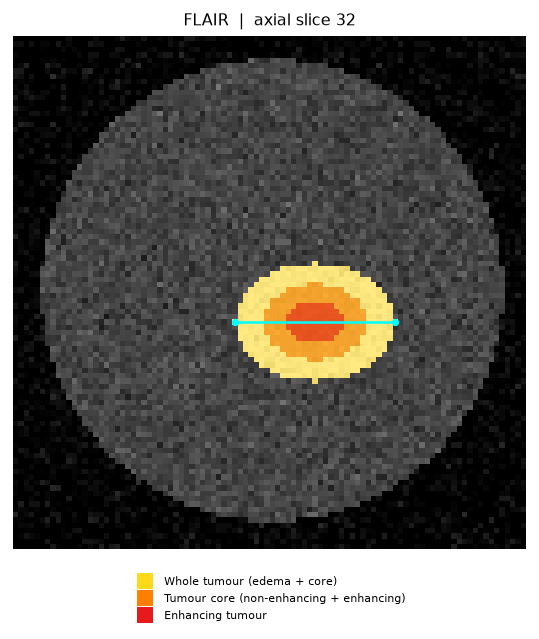

# Brain Tumour Measurement & Reporting (research prototype)

Segment a brain tumour from an MRI scan, **measure it in real millimetres**, and
auto-draft a structured report to speed up radiotherapy / radiology reporting.

> ⚠️ **NOT A MEDICAL DEVICE.** This is a research prototype. Every output is an
> AI-generated *draft* and must be independently verified by a qualified
> radiologist / radiation oncologist before any clinical use. It does not
> diagnose, and it does not give treatment advice.

---

## What it does

```
                ┌─► 2D U-Net segmentation ─► measurement engine ─┐
 MRI scan  ─────┤     (WT / TC / ET masks)   (volume, extents,    ├─► report draft
 (NIfTI/DICOM/  │                             diameters, location)│    (PDF + PNG
  2D image)     └─► type classifier ──────────────────────────────┘     + MD + JSON)
                    (glioma / meningioma / pituitary / no-tumour)
```

It answers both clinical questions on one page: **what kind** of tumour (classifier),
and **where / how big** it is (segmentation + measurement).

Reports are **bilingual (English + Arabic)** — every heading, finding, measurement and
disclaimer appears in both languages, with proper Arabic shaping and right-to-left layout
in the PDF.

For each standard BraTS region — **WT** whole tumour, **TC** tumour core,
**ET** enhancing tumour — the report gives:

- **Volume** in cm³ (millilitres)
- **Anatomical extents** LR × AP × SI in mm (bounding box mapped to orientation)
- **Maximum 3-D calliper diameter** in mm
- **RECIST-style longest axial diameter** and its perpendicular, with the slice index
- **Approximate location** of the centroid (side / anterior-posterior / superior-inferior)

plus an annotated key slice with the sub-regions overlaid and the longest diameter drawn.



## Install

```bash
pip install -e .
# or: pip install -r requirements.txt
```

Runs on CPU (no GPU required). Built and tested with Python 3.10–3.14, PyTorch (CPU).

## Quickstart

**1. Try it immediately (no data, no model)** — generates a synthetic phantom and reports on it:

```bash
brats-report --demo --out reports/demo
```

**2. Get a small real BraTS subset** (a few hundred MB, not the full 7.6 GB — see [Data](#data)):

```bash
python scripts/download_brats.py --n 30 --out data/brats_subset
```

**3. Train the models** (CPU-friendly):

```bash
# segmentation (BraTS)
python -m brats_report.train --data data/brats_subset --epochs 20 --out models/brats_unet.pt

# tumour-type classifier (Kaggle 4-class set; see Data)
python scripts/download_tumor_cls.py --out data/tumor_cls
python -m brats_report.train_classifier --data data/tumor_cls --out models/tumour_clf.pt

# 2-D single-image segmenter (LGG; for measuring 2-D images)
python scripts/download_lgg.py --out data/lgg_raw
python -m brats_report.train_seg2d --data data/lgg_raw --epochs 15 --out models/seg2d.pt
```

**4. Generate a report** (type + location + size):

```bash
# 3-D scan: segment + measure + classify
brats-report --image case.nii.gz --model models/brats_unet.pt \
    --classifier models/tumour_clf.pt --out reports/case01

# 2-D image: segment + measure + classify (dimensions in px, or mm with DICOM)
brats-report --image slice.jpg --seg2d models/seg2d.pt \
    --classifier models/tumour_clf.pt --out reports/case01
```

DICOM is supported: a folder of slices to `--image` (3-D), or a single `.dcm` (2-D, real mm).

**5. Or use the web UI** (upload a scan, get the report in the browser):

```bash
pip install -e ".[ui]"
python app.py          # open http://127.0.0.1:7860
```

A clinician uploads a NIfTI scan (or a 2-D MRI image) and gets the annotated slice,
the tumour type, the measurements, and a downloadable bilingual PDF — all on one page.

## How the measurements are computed

The measurement engine (`brats_report/measure.py`) is **pure geometry on the mask**
— no learning — so it is exact and unit-tested against phantoms of known size:

- **Volume** = voxel count × (sx·sy·sz) / 1000.
- **Extents** = bounding-box span along each image axis × that axis's spacing, with
  axes mapped to LR / AP / SI via the NIfTI orientation (`nibabel.aff2axcodes`).
- **Max 3-D / RECIST diameters** = largest calliper distance between mask points,
  computed exactly via the convex hull (`scipy.spatial.ConvexHull`), in physical mm
  so anisotropic spacing is handled correctly.

See `tests/test_measure.py` — e.g. an ellipsoid of semi-axes 14×10×8 mm is recovered
to within ~1 % on volume and exactly on extents.

## Data

Uses the **Medical Segmentation Decathlon `Task01_BrainTumour`** (a curated BraTS
subset): 4-modality MRI (FLAIR, T1w, T1gd, T2w) with expert masks, in NIfTI with real
mm voxel spacing.

The full archive is a single 7.6 GB `.tar` on a public S3 bucket. Rather than pull all
of it, `scripts/download_brats.py` uses **HTTP range requests** to fetch only:

- a *prefix* of the tar → the first *N* training images, and
- a *suffix* of the tar → all the training labels (which live at the tail),

then parses each partial tar in memory and writes out matched image/label pairs — a few
hundred MB instead of 7.6 GB, with per-range resume for flaky connections.

For **2-D single-image** segmentation it uses the **LGG** dataset (~110 patients, 2-D
FLAIR slices with binary tumour masks): `python scripts/download_lgg.py --out data/lgg_raw`.

## Model

A compact 2-D U-Net (`brats_report/model.py`, ~2 M params at `base=24`) operating on
axial slices, predicting three sigmoid maps for the nested regions WT ⊇ TC ⊇ ET, trained
with a Dice + BCE loss. Kept small so it trains on CPU; a single scan is segmented in
minutes at inference, which suits a reporting workflow.

## Results

Measured on a held-out split of the downloaded BraTS subset (see
`models/brats_unet.metrics.json` after training). Metrics are always reported from an
actual run — never hand-written.

**Segmentation** — Dice on a held-out split of the BraTS subset:

| Region | Dice (val) |
|---|---|
| Whole tumour (WT) | 0.685 |
| Tumour core (TC)  | 0.692 |
| Enhancing (ET)    | 0.771 |
| **Mean** | **0.716** |

(2-D U-Net, 24 train / 6 val patients, 128px, CPU, 12 epochs — an accessible baseline;
a 3-D model on the full BraTS set with a GPU reaches WT Dice ~0.90.)

**2-D single-image segmentation** — for measuring a tumour on one ordinary 2-D MRI image
(LGG dataset, patient-level split; `models/seg2d.metrics.json`):

| Metric | Dice (val, tumour slices) |
|---|---|
| Whole tumour (2-D) | 0.46 |

A CPU baseline (UNet2D, 128px, 15 epochs, patient-level split) — enough to outline the
tumour and measure it; more epochs / higher resolution / a GPU raise this substantially.
This powers dimension measurement on 2-D inputs (pixels, or mm with DICOM pixel spacing).

**Classification** — tumour type on the Kaggle test set (1311 images; ResNet18 frozen
backbone + head; `models/tumour_clf.metrics.json`):

| Metric | Value |
|---|---|
| Accuracy | **96.1%** |
| Macro F1 | **0.958** |
| Macro precision / recall | 0.960 / 0.958 |

Per-class: `notumor` is perfect (405/405); the only notable confusion is glioma↔meningioma
(the clinically hardest pair). Measured on the held-out test set — not hand-written.

> ⚠️ The classifier is trained on **clinical 2-D MRI (skull present)**. Applying it to
> skull-stripped multimodal research volumes (BraTS) is out-of-distribution and unreliable;
> reports flag this automatically. Use it on clinical-style 2-D MRI, and use the
> segmentation+measurement side on 3-D volumes.

## Project layout

```
src/brats_report/
  io.py          # load NIfTI / DICOM -> array + spacing + orientation
  synthetic.py   # phantom generator (tests + instant demo dataset)
  dataset.py     # 2D axial-slice dataset (normalise, resize, multilabel)
  model.py       # compact 2D U-Net (segmentation)
  losses.py      # Dice + BCE loss, Dice metric
  train.py       # segmentation training (per-region Dice, saves best + metrics.json)
  infer.py       # run model over a volume -> 3D label map (nested, largest CC)
  measure.py     # mask + spacing -> volumes, extents, calliper/RECIST diameters
  classify.py    # tumour-type classifier (torchvision backbone + head)
  train_classifier.py  # classifier training (cached features, honest test metrics)
  seg2d.py       # 2-D single-image tumour segmenter (load + predict)
  train_seg2d.py # 2-D segmenter training on LGG (patient-level split)
  report.py      # annotated slice + PDF / Markdown / JSON report (type + size), 3-D & 2-D
  cli.py         # `brats-report` end-to-end command
app.py           # Gradio web UI
scripts/download_brats.py         # range-request BraTS subset downloader
scripts/download_tumor_cls.py     # tumour-type classification dataset downloader
scripts/download_lgg.py           # 2-D segmentation (LGG) dataset downloader
tests/                            # measurement + pipeline + classifier + 2-D tests
```

## Limitations & intended use

- Research/education only; **not validated for clinical use** and not a regulated device.
- 2-D slice model — lighter and CPU-friendly, but less accurate than 3-D approaches; the
  "location" is a coarse orientation-based description, not an atlas-based lobe label.
- Trained on a small subset for accessibility; accuracy improves with more data / epochs.
- Always have outputs reviewed by a qualified clinician.

## License

MIT (with a medical disclaimer) — see [LICENSE](LICENSE).
