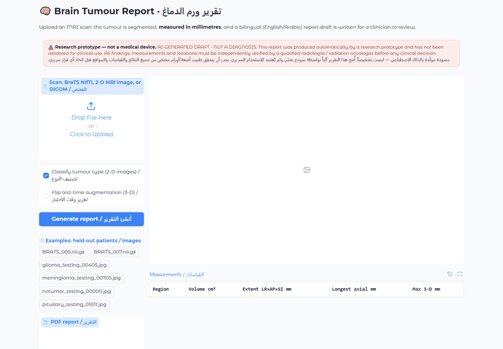
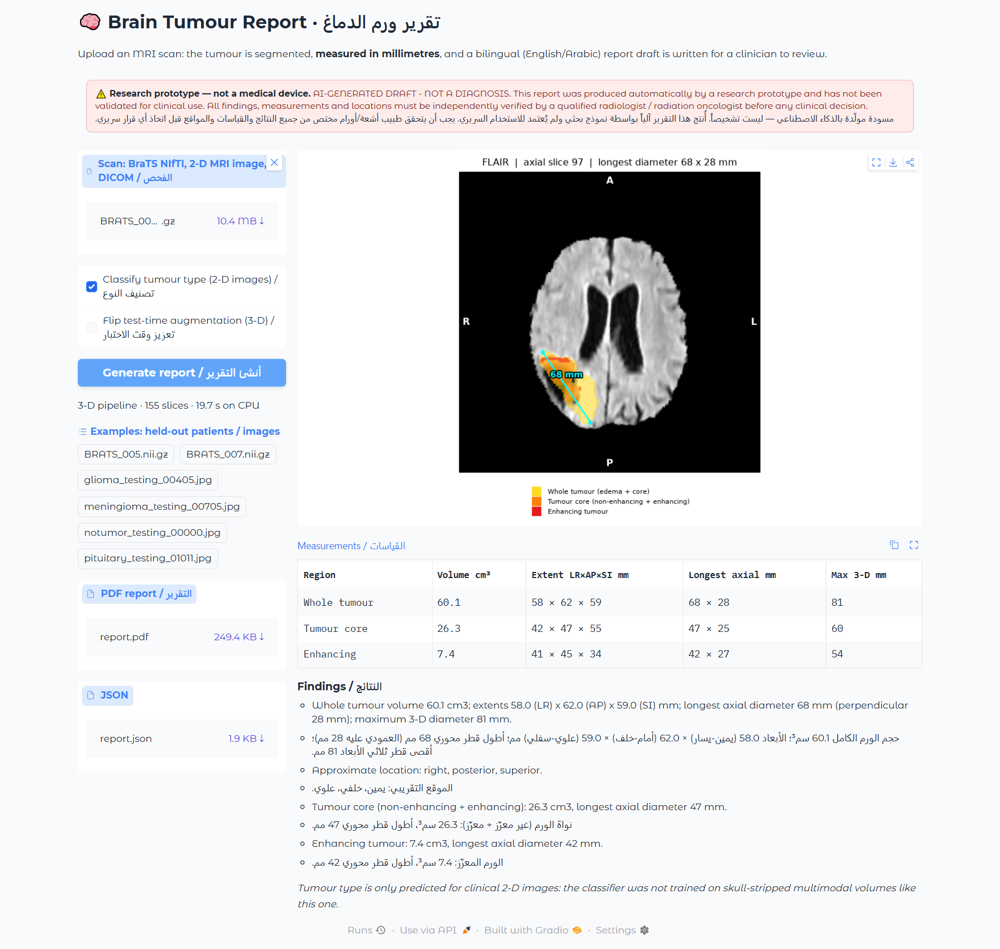
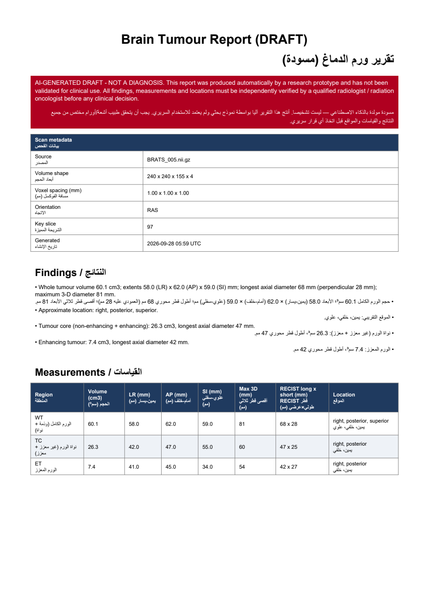
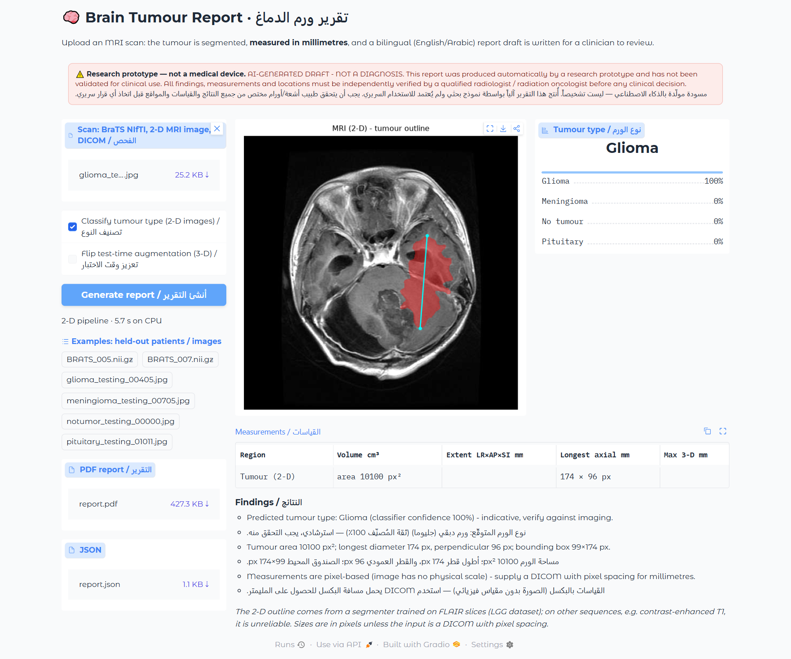
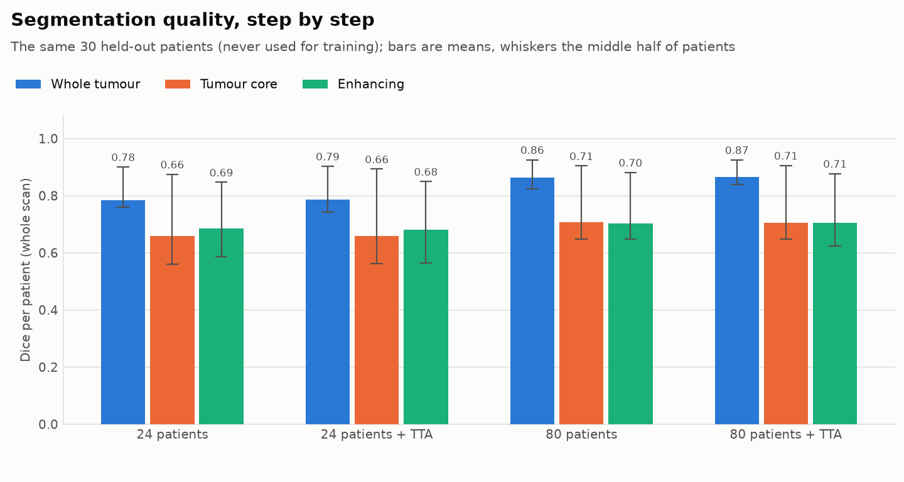
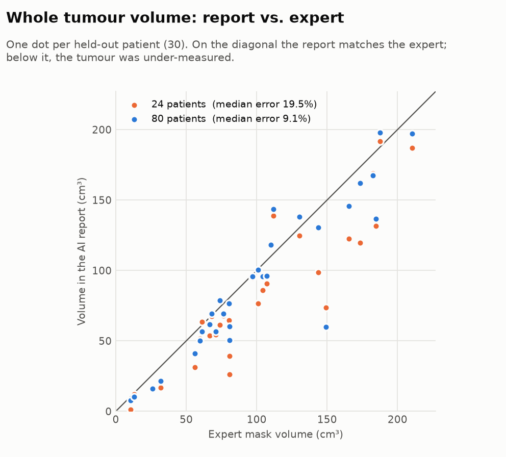
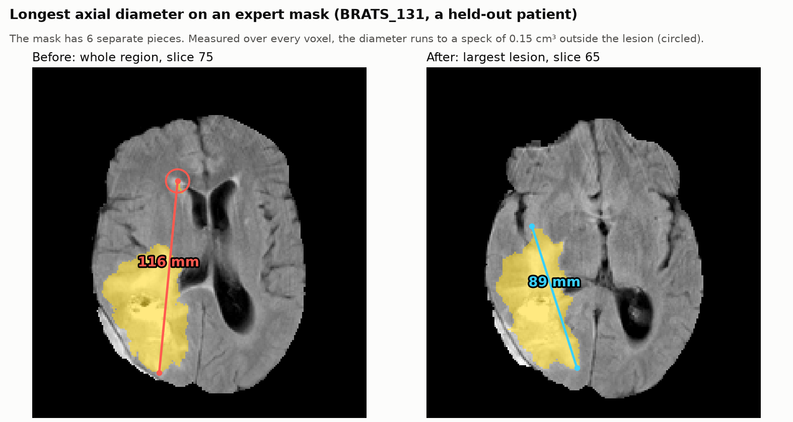
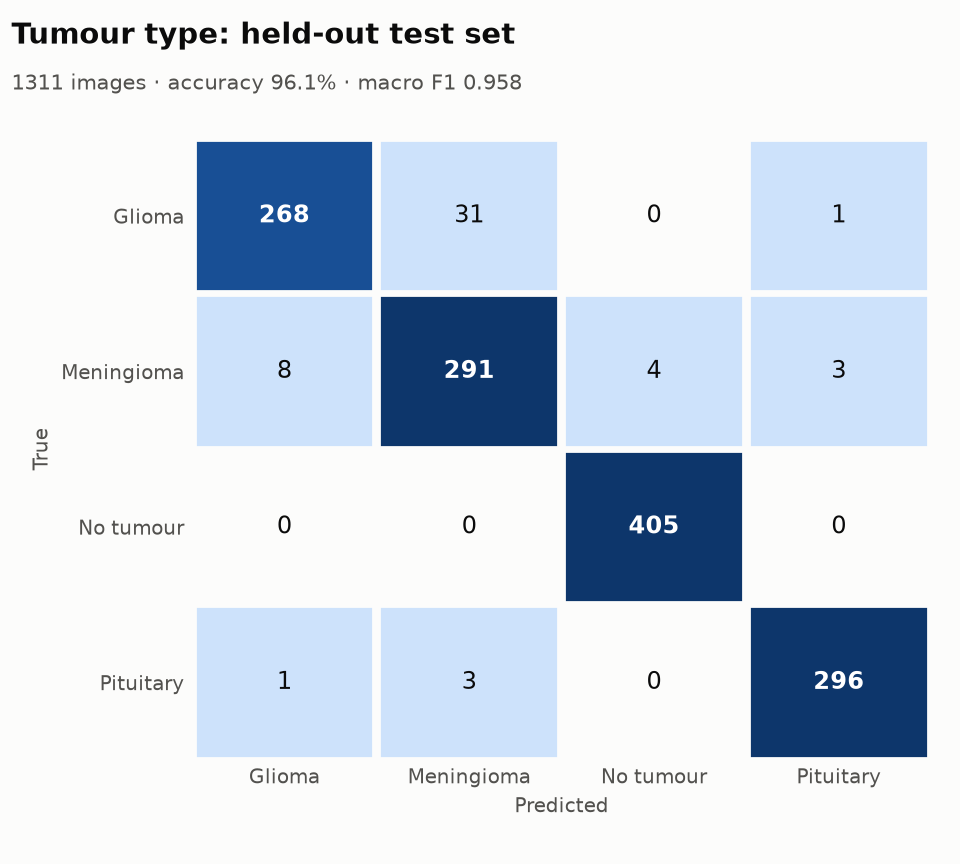

# Brain Tumour MRI → Measured Report

> Segments a brain tumour on MRI, **measures it in millimetres**, and drafts a
> bilingual (English / Arabic) radiotherapy report for a clinician to check.
> Every number the report prints is checked against expert masks on **30
> held-out patients**: not only Dice, but how far the report's **volume and
> diameters** are from the ones measured on the expert's mask.


> ⚠️ **Not a medical device.** A research prototype: every output is an
> AI-generated *draft* that a qualified radiologist / radiation oncologist must
> verify. It does not diagnose and gives no treatment advice.

**Highlights**

- **Measured in millimetres, on 30 held-out patients:** the report's
  whole-tumour volume is within a median **9.1 %** of the expert's (19.5 % for
  the first model), its diameters within about **5.5 mm** (9–10 mm before), and
  whole-tumour Dice is **0.86** (0.78).
- **A bug Dice can't see, found and fixed:** specks under 1 cm³ in the expert
  masks stretched reported diameters in **9 of 30** patients, by up to 26 mm.
  Diameters are now measured on the lesion, and a genuine second region is
  flagged in the report.
- **Honest negatives, measured too:** flip test-time augmentation and other
  clean-ups of the prediction didn't help, and the model still under-measures
  (−10 cm³ on average). All of it is in the tables below.
- **A report a clinician can read:** bilingual English / Arabic PDF, the
  measured diameter drawn on its slice, a web UI, ~20 s per scan on a laptop
  CPU; tumour type on 2-D images at 96.1 % accuracy (1,311 test images).
- **Reproducible:** a fixed split, per-patient JSON behind every number,
  `make` targets for each step, 37 tests and CI.



*The web UI on a held-out BraTS patient (CPU only): segmentation, the measured
longest diameter drawn on its slice, the measurement table, and the bilingual PDF.*

| A held-out patient's result | The report (PDF, English + Arabic) | A 2-D clinical image: tumour type |
|---|---|---|
|  |  |  |

---

## What it does

```
                ┌─► 2-D U-Net, slice by slice ─► 3-D mask ─► measurement engine ─┐
 MRI scan  ─────┤   (WT / TC / ET)               (nested,    (volume, extents,    ├─► report draft
 (NIfTI/DICOM/  │                                 largest     diameters, RECIST,  │   (PDF + PNG
  2-D image)    │                                 lesion)     location)           │    + MD + JSON)
                └─► type classifier (2-D clinical images) ─────────────────────────┘
                    (glioma / meningioma / pituitary / no tumour)
```

For each standard BraTS region — **WT** whole tumour, **TC** tumour core,
**ET** enhancing tumour — the report gives:

- **Volume** in cm³ (all voxels of the region: the tumour burden)
- **Extents** LR × AP × SI in mm, mapped from the scan's orientation
- **Maximum 3-D calliper diameter** in mm
- **RECIST-style longest axial diameter** and its perpendicular, with the slice
  it was measured on — the image shows that exact slice and line
- **Approximate location** of the lesion (side / anterior–posterior / superior–inferior)

Reports are **bilingual**: every heading, finding, measurement and disclaimer is
in English and Arabic, with Arabic shaped and laid out right-to-left in the PDF.

---

## Evaluation

Everything below is measured on the **same 30 held-out BraTS patients**, whole
3-D scans, one score per patient, with the same inference code the app runs
(`python -m brats_report.evaluate`). The split
([`data/brats_split.json`](data/brats_split.json)) was fixed before the new
model was trained, and none of the first model's training patients is in its
test set; every per-patient result is in [`docs/eval/`](docs/eval).

Dice measures overlap, but a report doesn't print Dice: it prints a volume in
cm³ and diameters in mm. So each prediction is also measured with the report's
own code and compared with the same measurements taken on the expert's mask:

- **Volume error** — |report − expert| / expert, median over patients; **bias**
  is the mean signed difference (negative = the report under-measures).
- **Diameter errors** — mean absolute difference, in mm, of the max 3-D
  diameter and of the longest axial (RECIST-style) diameter.
- **HD95** — the 95th-percentile distance between the predicted and expert
  tumour surfaces, in mm (median over patients).

### Segmentation, step by step

Same recipe throughout (2-D U-Net, 128 px, Dice + BCE, CPU); **bold** is what
the app ships. Whole-tumour (WT) columns are the ones a report leads with:

| step | Dice WT / TC / ET | WT HD95 | WT volume error (median) | WT volume bias | WT max 3-D diameter error | WT longest axial error |
|---|---|---|---|---|---|---|
| 24 training patients (the first model) | 0.78 / 0.66 / 0.69 | 5.8 mm | 19.5 % | −18.8 cm³ | 9.7 mm | 9.0 mm |
| 24 patients + flip TTA | 0.79 / 0.66 / 0.68 | 5.2 mm | 16.7 % | −19.2 cm³ | 10.4 mm | 9.6 mm |
| **80 training patients** | **0.86 / 0.71 / 0.70** | **4.1 mm** | **9.1 %** | **−10.1 cm³** | **5.5 mm** | **5.8 mm** |
| 80 patients + flip TTA | 0.87 / 0.71 / 0.71 | 4.1 mm | 10.5 % | −10.7 cm³ | 6.0 mm | 5.6 mm |





What the numbers say:

- **More data is the step that matters.** With 80 instead of 24 training
  patients and nothing else changed, whole-tumour Dice goes 0.78 → 0.86 and the
  report's volume error halves: median 19.5 % → 9.1 %, and within 10 % of the
  expert for 16 of 30 patients instead of 8. Diameter errors drop from 9–10 mm
  to about 5.5 mm, and patients with whole-tumour Dice under 0.7 go from 6 to 2.
- **Flip TTA doesn't pay for itself here.** For either model it changes mean
  Dice by at most 0.002 while doubling inference time, and with the 80-patient
  model the median volume error gets worse (9.1 % → 10.5 %). The app ships
  without it; it's a checkbox in the UI and `--tta` on the command line.
- **The model still under-measures.** The report's whole-tumour volume is
  below the expert's for 24 of 30 patients (−10 cm³ on average). More data
  halved that bias but didn't remove it; keeping more of the predicted pieces
  explains only about a third of it (see the notes at the end).
- **The enhancing tumour is the hardest to size.** ET volumes are small (a few
  cm³), so its median volume error stays around 24 %.

A scan takes about 20 s end to end on a 4-core laptop CPU (i7-8550U):
segmentation (~15 s), measurement and the PDF.

### A bug Dice could not see

The report's picture and its number disagreed: the key slice showed a
**53 mm** tumour, while the text said its longest diameter was **107 mm**. The
diameter code took the two farthest points of the whole region, and the expert
mask had a 0.14 cm³ speck far from the tumour (a single pixel on the slice where
the diameter was measured). Dice can't catch this: the mask is correct; the
measurement code is wrong.

Running the old and the new code on the **expert masks of the 30 test
patients** ([`scripts/islands_effect.py`](scripts/islands_effect.py)):

- **27 of 30** whole-tumour masks have more than one connected piece.
- In **9 patients**, a speck **under 1 cm³** (down to a single voxel) at the
  end of a calliper stretched a diameter: the longest axial diameter in 5
  patients (by up to **26 mm**), the max 3-D diameter in 8 (by up to 15 mm).
- In one patient the far end was a genuine second region (55 cm³ next to a
  93 cm³ one), so the old "diameter" spanned two lesions (+39 mm axial,
  +57 mm 3-D).



Now diameters, extents and location are measured on the **largest connected
lesion**, volume still counts every voxel, and when a second region of at
least 1 cm³ exists the report says so (2 of the 30 expert masks). The figure is
[`scripts/islands_figure.py`](scripts/islands_figure.py); a unit test pins the
behaviour (`tests/test_measure.py`).

### Tumour type (2-D clinical images)

ResNet-18 features (frozen) with a small trained head, on the standard
held-out test set of 1,311 images: **96.1 % accuracy, macro F1 0.958**
([`docs/eval/classifier.json`](docs/eval/classifier.json)). Every "no tumour"
image is classified correctly; the main confusion is glioma → meningioma (31 of
300 gliomas), the pair radiologists also find hardest on a single slice.



### 2-D single-image segmenter

Trained on FLAIR slices of the LGG dataset: Dice **0.46** on held-out
patients' tumour slices. It is the weakest part of the project, and it is
unreliable on other MRI sequences; see the notes below.

---

## How it works

1. **Load** (`io.py`) — NIfTI or a DICOM series into an array, with the voxel
   spacing in mm and the orientation codes (`nibabel.aff2axcodes`), which is what
   makes millimetres and left/right possible at all.
2. **Segment** (`model.py`, `infer.py`) — a compact 2-D U-Net (4.4 M parameters)
   reads each axial slice's four MRI sequences (FLAIR, T1, T1-contrast, T2) and
   predicts three nested maps (WT ⊇ TC ⊇ ET). Predictions are resized back to the
   scan's native grid, so measurements stay in true millimetres. Optional **flip
   TTA** also predicts each slice mirrored left–right and averages the two (it
   didn't pay off; see above). The largest connected tumour is kept.
3. **Measure** (`measure.py`) — pure geometry on the mask, no learning, so it's
   unit-tested against phantoms of known size (an ellipsoid of semi-axes
   14 × 10 × 8 mm comes back within ~1 % on volume and exactly on extents):
   - volume = voxels × voxel volume;
   - extents = bounding box per axis × spacing, named LR / AP / SI from the orientation;
   - diameters = the largest calliper distance, computed exactly on the convex
     hull in physical mm (anisotropic spacing handled);
   - geometry is measured on the **largest connected lesion** — see
     [the bug this fixed](#a-bug-dice-could-not-see) — and when the tumour has a
     second region of 1 cm³ or more, the report says so rather than silently
     measuring one of them.
4. **Classify** (`classify.py`) — a ResNet-18 (ImageNet features, frozen) with a
   small head, trained on 5,712 clinical 2-D MRI images. It is only offered for
   2-D clinical images: skull-stripped research volumes like BraTS are outside
   what it was trained on, so the UI doesn't show a type for them.
5. **Report** (`report.py`, `i18n.py`) — annotated slice (radiological
   convention, L/R/A/P marked), PDF, Markdown and JSON.

---

## Quickstart

```bash
pip install -e ".[dev,ui]"
brats-report --demo --out reports/demo        # synthetic phantom -> report; no data, no model
```

The full pipeline, reproducible end to end (`Makefile` targets; CPU only):

```bash
make data        # 120 BraTS patients, ~1.3 GB of the 7.6 GB archive (range requests)
make split       # fixed 80 / 10 / 30 train / val / test split
make train       # the U-Net on the 80 training patients
make eval        # whole-scan Dice, HD95 and measurement error on the 30 test patients
make charts      # the charts in this README
make ui          # Gradio app at http://127.0.0.1:7860
```

Report for one scan from the command line:

```bash
# 3-D scan: segment + measure (add --tta for flip test-time augmentation)
brats-report --image case.nii.gz --model models/brats_unet.pt --out reports/case01

# 2-D image: segment + measure + tumour type (pixels, or mm for a DICOM with pixel spacing)
brats-report --image slice.jpg --seg2d models/seg2d.pt --classifier models/tumour_clf.pt \
    --out reports/case02
```

Tumour-type classifier and 2-D segmenter:

```bash
python scripts/download_tumor_cls.py --out data/tumor_cls
python -m brats_report.train_classifier --data data/tumor_cls --out models/tumour_clf.pt
python scripts/download_lgg.py --out data/lgg_raw
python -m brats_report.train_seg2d --data data/lgg_raw --epochs 15 --out models/seg2d.pt
```

---

## Data

| Dataset | Used for | Size used | Source |
|---|---|---|---|
| BraTS via Medical Segmentation Decathlon `Task01_BrainTumour` | 3-D segmentation, all measurement evaluation | 120 of 484 patients (80 / 10 / 30) | [medicaldecathlon.com](http://medicaldecathlon.com/), CC-BY-SA 4.0 |
| Brain Tumor MRI (glioma / meningioma / pituitary / no tumour) | tumour-type classifier | 5,712 train / 1,311 test images | the standard Kaggle 7,023-image set (Hugging Face mirror `Simezu/brain-tumour-MRI-scan`) |
| LGG MRI segmentation (Buda et al., `kaggle_3m`) | 2-D single-image segmenter | ~110 patients | Hugging Face mirror `gymprathap/Brain-MRI-LGG-Segmentation` |

The BraTS archive is a single 7.6 GB `.tar`. Training images sit at its start
and the labels at its end (~30 KB each), so `scripts/download_brats.py` fetches
only those two byte ranges — about 1.3 GB for 120 patients — with parallel,
resumable HTTP range requests, and parses the partial tar. See
[`data/README.md`](data/README.md).

---

## Project structure

```
brain-tumor-radiotherapy/
├── src/brats_report/
│   ├── io.py                # NIfTI / DICOM -> array + spacing + orientation
│   ├── dataset.py           # axial-slice datasets (BraTS 4-channel, LGG 2-D)
│   ├── model.py  losses.py  # compact 2-D U-Net, Dice + BCE / Tversky losses
│   ├── train.py             # segmentation training (fixed split, best-on-val checkpoint)
│   ├── infer.py             # whole-volume inference, flip TTA, nested regions, largest lesion
│   ├── measure.py           # mask + spacing -> volume, extents, calliper / RECIST diameters
│   ├── evaluate.py          # split + per-patient Dice, HD95 and measurement error
│   ├── charts.py            # the README charts, from the eval JSONs
│   ├── classify.py  train_classifier.py   # tumour type (ResNet-18 features + head)
│   ├── seg2d.py  train_seg2d.py           # single 2-D image segmenter (LGG)
│   ├── report.py  i18n.py   # annotated slice + bilingual PDF / Markdown / JSON
│   └── cli.py               # `brats-report`
├── scripts/                 # dataset downloaders, UI examples, demo recorder
├── data/brats_split.json    # the fixed split (data itself is git-ignored)
├── docs/eval/*.json         # every number in this README, per patient
├── docs/images/             # charts, screenshots, demo GIF
├── app.py                   # Gradio web UI
└── tests/                   # measurement, metrics, pipeline, bilingual report
```

---

## Design notes & honesty

- **The test set was fixed before the new model was trained.**
  `data/brats_split.json` holds 80 train / 10 val / 30 test patients (seed 0).
  The 30 test patients were never used for training or for picking a
  checkpoint, and none of the first model's own training or validation
  patients are among them (`data/baseline_cases.txt`), so both models are
  compared on patients neither has seen.
- **Scored on whole scans, per patient.** The Dice printed during training is
  slice-level, over tumour slices only, and flatters the model. Every number in
  the tables comes from `brats_report.evaluate` running the same inference code
  as the app on the full 3-D scan, and every per-patient result is in
  [`docs/eval/`](docs/eval) so any row can be checked.
- **Report numbers, not only overlap.** Volumes and diameters are compared with
  the same measurements taken on the expert mask by the same code, so the error
  columns isolate the segmentation, not the measurement method.
- **Geometry is measured on the largest lesion; volume counts every voxel.** For
  a truly multifocal tumour the diameters describe the largest lesion only, so
  when there are two or more regions of at least 1 cm³ the report adds a note
  saying exactly that; the JSON lists every region's piece count
  (`components`, `large_pieces`). The 1 cm³ line separating a speck from a
  region is a judgement call, not a clinical standard.
- **A 2-D model, trained on a CPU.** Slice-by-slice segmentation of 120 of the 484
  public training patients keeps training on a laptop feasible; 3-D networks
  trained on the full BraTS data with GPUs reach whole-tumour Dice around 0.9.
  The point of this project is the measured pipeline around the model, which a
  stronger model would slot into (`infer.load_model` / `predict_probs`).
- **Keeping only the largest predicted piece is a measured choice.** Keeping
  every piece of at least 1 cm³ instead: for the 24-patient model the
  under-measurement bias shrank only a little (−18.8 → −15.1 cm³) while HD95
  got worse (5.8 → 7.8 mm), as most extra predicted pieces were false
  positives; for the 80-patient model the bias went −10.1 → −6.6 cm³, but the
  median volume error rose (9.1 → 9.8 %) and so did the tumour-core boundary
  error (HD95 6.3 → 8.1 mm). So the app keeps the largest piece; with
  `--post min1cm3` a second predicted region survives and the report flags it
  (`docs/eval/*_min1cm3.json`, `*_all.json`).
- **Flip TTA is off by default.** It doubles inference time (two passes per
  slice) and didn't improve the report's numbers on the test patients.
- **Tumour type only where it's valid.** The classifier was trained on clinical
  2-D MRI with the skull present; BraTS volumes are skull-stripped and
  multimodal, so for them the UI shows no type and the CLI report flags it as
  out of distribution.
- **The 2-D segmenter is the weakest part.** Trained on FLAIR slices of the LGG
  dataset (Dice 0.46 on held-out patients' tumour slices), it misplaces the
  outline on other sequences such as contrast-enhanced T1 — the UI says so under
  its result. Without DICOM pixel spacing, 2-D sizes are in pixels.
- **Location is coarse and atlas-free** (side / front–back / up–down from the
  lesion's centroid), not a lobe label.
- **Not validated for clinical use.** A qualified clinician must review every output.

## License

MIT with a medical disclaimer — see [LICENSE](LICENSE). BraTS / MSD data:
CC-BY-SA 4.0 (Medical Segmentation Decathlon); please cite the MSD and BraTS
challenges if you use it.
